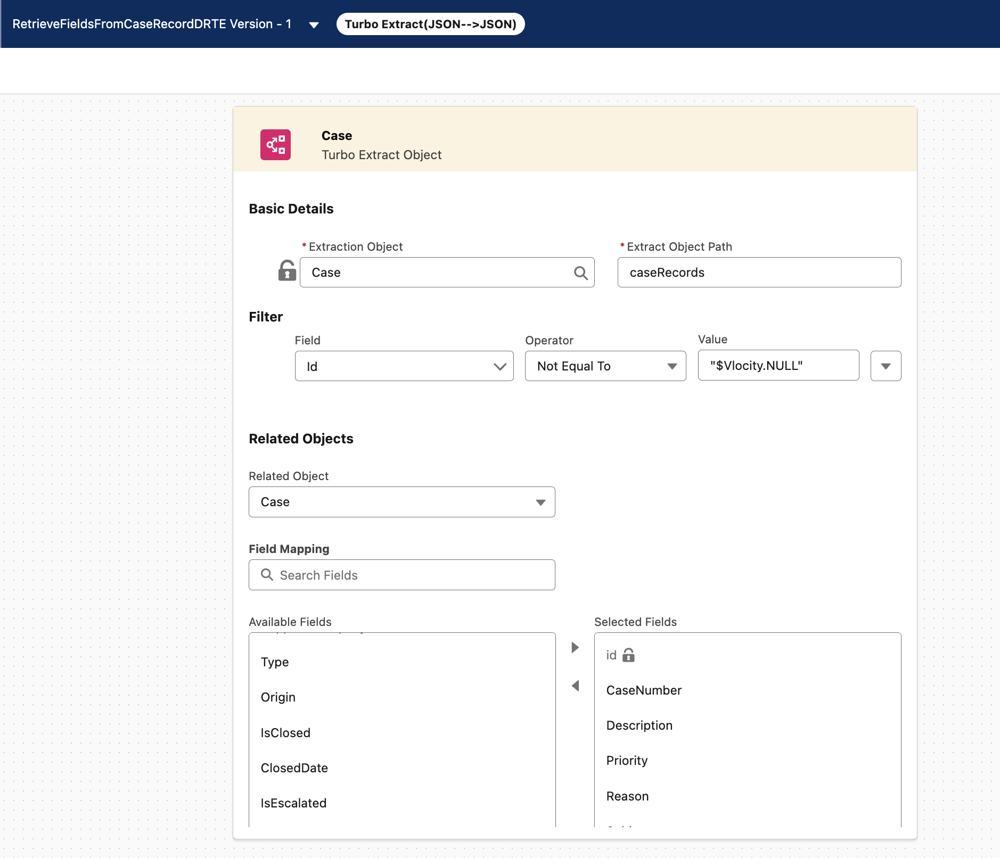
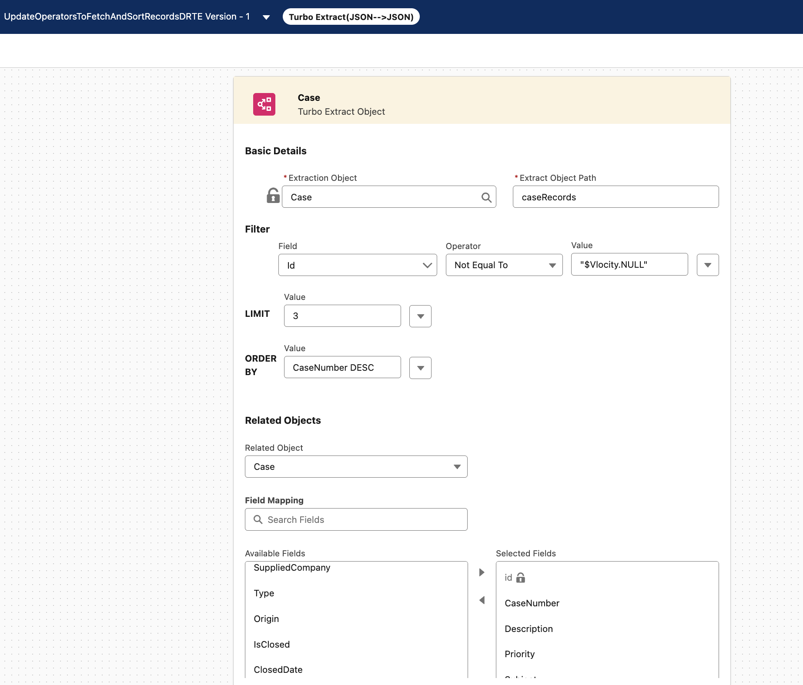
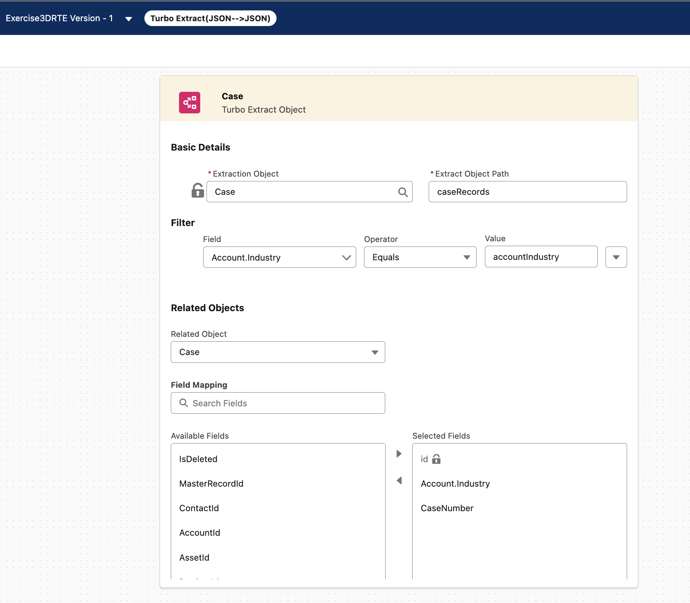
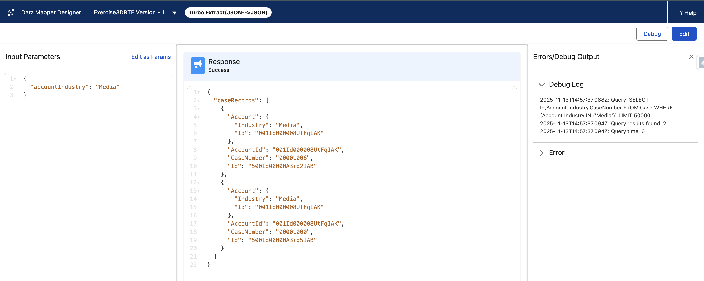
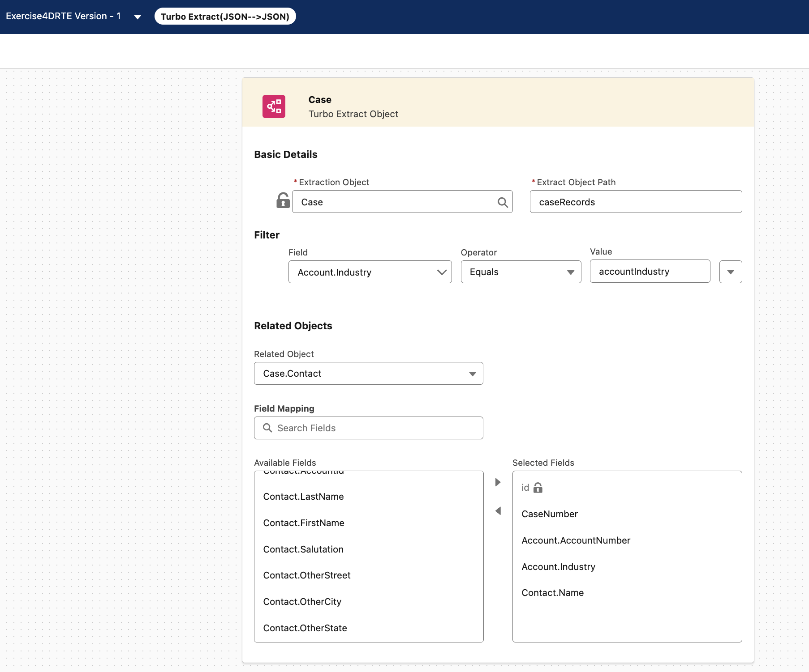
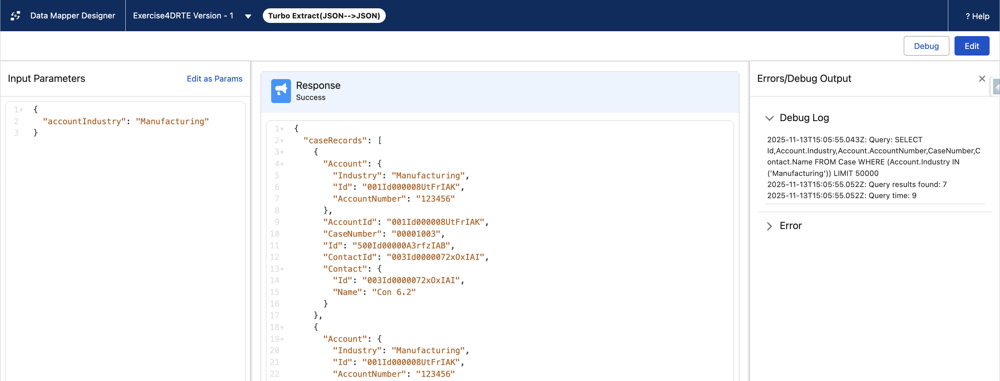

# OmniStudio
## DataRaptor (Mapper) Turbo Extract
### Exercise 1 - Retrieve Fields From Case Record

Use DataRaptor Turbo Extract to fetch Case records and the following fields
•Id
•Case Number
•Description
•Priority
•Reason
•Status
•Subject

[Exercise1DRTE](force-app/main/default/omniDataTransforms/RetrieveFieldsFromCaseRecordDRTE_1.rpt-meta.xml)  
 

### Exercise 2 - Using Operators to fetch and sort Case Records

Use DataRaptor Turbo Extract to fetch 3 Case records and the following fields and order the records by Case Number in descending order
•Id
•Case Number
•Description
•Priority
•Reason
•Status
•Subject

[Exercise2DRTE](force-app/main/default/omniDataTransforms/UpdateOperatorsToFetchAndSortRecordsDRTE_1.rpt-meta.xml)  
 

### Exercise 3 - Using Variable to fetch Case Records and Relationship Notation as a Filter on associated Account Record

Use DataRaptor Turbo Extract to fetch Case records and the following fields where the Industry field on Account Object is determined by a variable named accountindustry. Add key/value pair as the input parameter to test the DataRaptor.
•Id
•Case Number
•Industry

[Exercise3DRTE](force-app/main/default/omniDataTransforms/Exercise3DRTE_1.rpt-meta.xml)  

 

### Exercise 4 - Fetch Case Records and Relationship Notation as a Filter on associated Account and Contact Record

Use DataRaptor Turbo Extract to fetch Case records and the following fields where the Industry field on Account Object is 'Manufacturing'
•Id
•Case Number
•AccountNumber from Account Object
•Industry from Account Object
•Name from Contact Object

[Exercise4DRTE](force-app/main/default/omniDataTransforms/Exercise4DRTE_1.rpt-meta.xml)  

 

